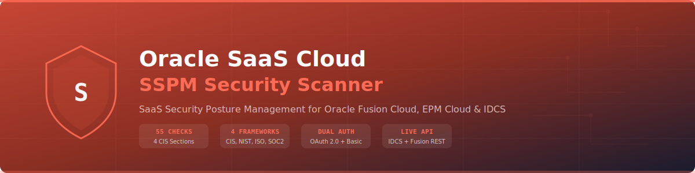

<p align="center">
  
</p>

<p align="center">
  
  
  
  
  
  
  
</p>

# Oracle SaaS Cloud SSPM Scanner

**SaaS Security Posture Management** for Oracle Fusion Cloud (ERP, HCM, SCM, CX), EPM Cloud, and Oracle IDCS / OCI IAM Identity Domains.

Performs **55 live security checks** across 4 CIS benchmark sections via IDCS and Fusion Cloud REST APIs. Maps every finding to **CIS Oracle SaaS v1.0.0**, NIST 800-53 Rev 5, ISO 27001:2022, and SOC 2 Type II.

## Key Features

- **55 security checks** across Identity, Configuration, Networking, and Logging
- **CIS Oracle Cloud Infrastructure SaaS Cloud Applications Benchmark v1.0.0** (~95% coverage)
- **Dual authentication**: OAuth 2.0 Client Credentials (primary) + Basic Auth (fallback)
- **Dual API**: IDCS `/admin/v1/*` + Fusion Cloud REST APIs
- **Graceful degradation**: IDCS-only mode when Fusion URL not provided
- **4 compliance frameworks** per finding: CIS, NIST, ISO, SOC 2
- **3 output formats**: console (ANSI color), JSON, self-contained HTML dashboard
- **Single-file scanner** — zero setup beyond `pip install requests`
- **CI/CD integration** — exit code 1 on CRITICAL/HIGH findings

## Quick Start

```bash
# Install
pip install requests

# Run with OAuth 2.0 (recommended)
python oracle_saas_scanner.py \
    --idcs-url https://idcs-abc123.identity.oraclecloud.com \
    --client-id <client-id> \
    --client-secret <client-secret>

# Run with Fusion Cloud (full mode)
python oracle_saas_scanner.py \
    --idcs-url https://idcs-abc123.identity.oraclecloud.com \
    --fusion-url https://myco.fa.us2.oraclecloud.com \
    --client-id <client-id> \
    --client-secret <client-secret> \
    --html report.html --json report.json

# Run with Basic Auth (fallback)
python oracle_saas_scanner.py \
    --idcs-url https://idcs-abc123.identity.oraclecloud.com \
    --username admin@myco.com \
    --password <password>

# Filter by severity
python oracle_saas_scanner.py \
    --idcs-url https://idcs-abc123.identity.oraclecloud.com \
    --client-id <id> --client-secret <secret> \
    --severity HIGH
```

## Environment Variables

| Variable | Description |
|----------|-------------|
| `ORACLE_IDCS_URL` | IDCS / Identity Domain URL |
| `ORACLE_FUSION_URL` | Oracle Fusion Cloud URL (optional) |
| `ORACLE_CLIENT_ID` | OAuth 2.0 Client ID |
| `ORACLE_CLIENT_SECRET` | OAuth 2.0 Client Secret |
| `ORACLE_USERNAME` | Basic Auth username |
| `ORACLE_PASSWORD` | Basic Auth password |

## Authentication Setup

### OAuth 2.0 Client Credentials (Recommended)

1. Navigate to **Identity Domain > Applications > Add Application**
2. Select **Confidential Application**
3. Under **Client Configuration**, select **Client Credentials** grant type
4. Under **Token Issuance Policy**, grant these scopes:
   - `urn:opc:idm:t.security.client`
   - `urn:opc:idm:t.user.me`
   - `urn:opc:idm:t.groups`
   - `urn:opc:idm:t.users`
   - `urn:opc:idm:t.app.catalog`
5. **Activate** the application
6. Copy the **Client ID** and **Client Secret**

### Fusion Cloud Access

For Configuration Management checks, assign the scanner's IDCS user (or the OAuth client's service account) the **IT Security Manager** (`ORA_FND_IT_SECURITY_MANAGER_JOB`) role in Fusion Cloud Security Console.

## Check Inventory (55 checks)

### Section 1: Identity and Access Management (22 checks)

| Rule ID | CIS | Title | Severity |
|---------|-----|-------|----------|
| OSAAS-IAM-001 | 1.1.1 | Password minimum length below 8 characters | HIGH |
| OSAAS-IAM-002 | 1.1.1 | Password uppercase characters not required | MEDIUM |
| OSAAS-IAM-003 | 1.1.1 | Password lowercase characters not required | MEDIUM |
| OSAAS-IAM-004 | 1.1.1 | Password numeric characters not required | MEDIUM |
| OSAAS-IAM-005 | 1.1.1 | Password special characters not required | MEDIUM |
| OSAAS-IAM-006 | 1.1.2 | Password expiration disabled or > 90 days | MEDIUM |
| OSAAS-IAM-007 | 1.1.2 | Password history too short (< 5 previous) | LOW |
| OSAAS-IAM-008 | 1.1.3 | Account lockout threshold too high (> 10 attempts) | HIGH |
| OSAAS-IAM-009 | 1.1.3 | Account lockout duration too short (< 30 min) | MEDIUM |
| OSAAS-IAM-010 | 1.2.1 | MFA not enforced for all users | CRITICAL |
| OSAAS-IAM-011 | 1.2.2 | MFA not enforced for administrator roles | CRITICAL |
| OSAAS-IAM-012 | 1.2.3 | Only weak MFA factors enabled (SMS/Email) | MEDIUM |
| OSAAS-IAM-013 | 1.3.1 | SSO/SAML federation not configured | HIGH |
| OSAAS-IAM-014 | 1.3.2 | OAuth clients with excessive admin scopes | HIGH |
| OSAAS-IAM-015 | 1.3.2 | Stale OAuth clients not modified in 180+ days | MEDIUM |
| OSAAS-IAM-016 | 1.4.1 | IDCS privileged groups have excessive members | HIGH |
| OSAAS-IAM-017 | 1.4.2 | Fusion Cloud privileged roles over-provisioned | HIGH |
| OSAAS-IAM-018 | 1.5.1 | Active users not logged in for 90+ days | MEDIUM |
| OSAAS-IAM-019 | 1.5.2 | Terminated users still active in IDCS | HIGH |
| OSAAS-IAM-020 | 1.6.1 | No IP-based restriction for admin Sign-On Policy | HIGH |
| OSAAS-IAM-021 | 1.6.2 | Self-registration enabled in Identity Domain | MEDIUM |
| OSAAS-IAM-022 | 1.2.4 | Sign-On Policy contains MFA bypass rules | CRITICAL |

### Section 2: Configuration Management (13 checks)

| Rule ID | CIS | Title | Severity |
|---------|-----|-------|----------|
| OSAAS-CFG-001 | 2.1.1 | High-risk config change monitoring not enabled | HIGH |
| OSAAS-CFG-002 | 2.1.2 | Unused custom roles with no members | MEDIUM |
| OSAAS-CFG-003 | 2.1.3 | Custom roles with admin-level privileges | HIGH |
| OSAAS-CFG-004 | 2.2.1 | Configuration change approval workflow not detected | HIGH |
| OSAAS-CFG-005 | 2.2.2 | Sandbox promoted without approval | MEDIUM |
| OSAAS-CFG-006 | 2.3.1 | Flexfield-level security not enforced | MEDIUM |
| OSAAS-CFG-007 | 2.3.2 | Data role assignments with unrestricted scope | HIGH |
| OSAAS-CFG-008 | 2.3.3 | Security profiles with view-all access | HIGH |
| OSAAS-CFG-009 | 2.4.1 | EPM Cloud configuration snapshots not found | MEDIUM |
| OSAAS-CFG-010 | 2.4.2 | Implementation projects open > 90 days | LOW |
| OSAAS-CFG-011 | 2.5.1 | Scheduled processes running with elevated privileges | HIGH |
| OSAAS-CFG-012 | 2.5.2 | Integration user accounts with admin roles | HIGH |
| OSAAS-CFG-013 | 2.5.3 | Excessive active customizations (> 50 sandboxes) | LOW |

### Section 3: Networking (10 checks)

| Rule ID | CIS | Title | Severity |
|---------|-----|-------|----------|
| OSAAS-NET-001 | 3.1.1 | Location-Based Access Control (LBAC) not configured | HIGH |
| OSAAS-NET-002 | 3.1.2 | Network perimeters with overly broad CIDR ranges | MEDIUM |
| OSAAS-NET-003 | 3.1.3 | No network perimeter on admin Sign-On Policy rules | HIGH |
| OSAAS-NET-004 | 3.2.1 | WAF not configured for Identity Domain endpoints | HIGH |
| OSAAS-NET-005 | 3.2.2 | CORS allows wildcard origins | MEDIUM |
| OSAAS-NET-006 | 3.3.1 | Identity Domain IP filtering not enabled | HIGH |
| OSAAS-NET-007 | 3.3.2 | Token endpoint accessible without IP restriction | MEDIUM |
| OSAAS-NET-008 | 3.4.1 | Session timeout too long (> 480 min) | MEDIUM |
| OSAAS-NET-009 | 3.4.2 | Persistent sessions enabled (no re-auth required) | HIGH |
| OSAAS-NET-010 | 3.1.4 | Network perimeters include RFC1918 private ranges | LOW |

### Section 4: Logging and Monitoring (10 checks)

| Rule ID | CIS | Title | Severity |
|---------|-----|-------|----------|
| OSAAS-LOG-001 | 4.1.1 | Fusion Cloud audit data export not configured | HIGH |
| OSAAS-LOG-002 | 4.1.2 | EPM Cloud audit data export not configured | HIGH |
| OSAAS-LOG-003 | 4.1.3 | IDCS audit events not enabled | HIGH |
| OSAAS-LOG-004 | 4.2.1 | No Separation of Duties (SoD) violation monitoring | CRITICAL |
| OSAAS-LOG-005 | 4.2.2 | Audit log retention period too short (< 90 days) | MEDIUM |
| OSAAS-LOG-006 | 4.3.1 | No real-time alerting for privileged operations | HIGH |
| OSAAS-LOG-007 | 4.3.2 | Login failure event monitoring not enabled | HIGH |
| OSAAS-LOG-008 | 4.3.3 | Security Console audit trail not enabled | MEDIUM |
| OSAAS-LOG-009 | 4.4.1 | No SIEM/OCI Logging integration for IDCS events | MEDIUM |
| OSAAS-LOG-010 | 4.4.2 | Diagnostic logging level above WARNING | LOW |

## Compliance Frameworks

Every finding maps to four compliance frameworks:

| Framework | Standard | Coverage |
|-----------|----------|----------|
| CIS Oracle SaaS | v1.0.0 | ~95% of recommendations |
| NIST SP 800-53 | Rev 5 | 22 control families |
| ISO/IEC 27001 | 2022 | Annex A controls |
| SOC 2 Type II | TSC | CC6, CC7, CC8 criteria |

## Architecture

```
oracle_saas_scanner.py (single file, 2,872 lines)
  |
  +-- OracleSaaSScanner class
  |     +-- _authenticate()         # OAuth 2.0 / Basic Auth
  |     +-- _idcs_get/single()      # SCIM pagination
  |     +-- _fusion_get/single()    # REST offset/limit pagination
  |     |
  |     +-- Section 1: 8 check methods  (22 IAM findings)
  |     +-- Section 2: 5 check methods  (13 CFG findings)
  |     +-- Section 3: 4 check methods  (10 NET findings)
  |     +-- Section 4: 4 check methods  (10 LOG findings)
  |     |
  |     +-- print_report()          # ANSI console
  |     +-- save_json()             # JSON export
  |     +-- save_html()             # HTML dashboard (Oracle #C74634)
  |
  +-- Finding class (__slots__)
  +-- COMPLIANCE_MAP (55 entries)
  +-- main() CLI (argparse)
```

### API Flow

```
Oracle IDCS                          Oracle Fusion Cloud
  /admin/v1/PasswordPolicies           /fscmRestApi/.../auditPolicies
  /admin/v1/SignOnPolicies             /fscmRestApi/.../setupAndMaintenance/*
  /admin/v1/AuthenticationFactorSettings /hcmRestApi/.../roles
  /admin/v1/IdentityProviders          /hcmRestApi/.../dataSecurityPolicies
  /admin/v1/Apps                       /hcmRestApi/.../securityProfiles
  /admin/v1/Groups                     /hcmRestApi/.../userRoleAssignments
  /admin/v1/Users                      /fscmRestApi/.../erpintegrations
  /admin/v1/NetworkPerimeters          /interop/rest/v3/applicationsnapshots
  /admin/v1/Settings                   /interop/rest/v3/auditlog
        |                                     |
        v                                     v
  +--[ OracleSaaSScanner ]-------------------+
  |   55 findings  x  4 compliance frameworks |
  +----+--------+--------+-------------------+
       |        |        |
    Console    JSON     HTML
```

## CLI Reference

```
usage: oracle_saas_scanner [-h] [--idcs-url URL] [--fusion-url URL]
                           [--client-id ID] [--client-secret SECRET]
                           [--username USER] [--password PASS]
                           [--severity {CRITICAL,HIGH,MEDIUM,LOW}]
                           [--json FILE] [--html FILE] [--verbose] [--version]
```

| Argument | Description | Required |
|----------|-------------|----------|
| `--idcs-url` | IDCS / Identity Domain URL | Yes |
| `--fusion-url` | Oracle Fusion Cloud URL | No (skips CFG checks) |
| `--client-id` | OAuth 2.0 Client ID | Yes (or use Basic Auth) |
| `--client-secret` | OAuth 2.0 Client Secret | Yes (or use Basic Auth) |
| `--username` / `-u` | Basic Auth username | Fallback |
| `--password` / `-p` | Basic Auth password | Fallback |
| `--severity` | Min severity: CRITICAL, HIGH, MEDIUM, LOW | No (default: LOW) |
| `--json FILE` | Export findings as JSON | No |
| `--html FILE` | Export self-contained HTML report | No |
| `--verbose` / `-v` | Verbose output (API calls, skipped endpoints) | No |
| `--version` | Show version and exit | No |

## Operating Modes

| Mode | Requirements | Checks |
|------|-------------|--------|
| **IDCS-only** | `--idcs-url` + auth | 32 checks (IAM + NET + partial LOG) |
| **Full (IDCS + Fusion)** | `--idcs-url` + `--fusion-url` + auth | All 55 checks |

## Exit Codes

| Code | Meaning |
|------|---------|
| `0` | No CRITICAL or HIGH findings |
| `1` | CRITICAL or HIGH findings detected |
| `2` | CLI argument error |

## Related Projects

| Project | Repository |
|---------|-----------|
| OCI CNAPP Security Scanner | [OCI-CNAPP-Security-Scanner](https://github.com/Krishcalin/OCI-CNAPP-Security-Scanner) |
| Microsoft 365 SSPM Scanner | [SSPM-O365](https://github.com/Krishcalin/SSPM-O365) |
| ServiceNow SSPM Scanner | [SSPM-ServiceNow](https://github.com/Krishcalin/SSPM-ServiceNow) |
| SAP SuccessFactors SSPM | [SAP-SuccessFactors](https://github.com/Krishcalin/SAP-SuccessFactors) |
| Oracle EBS Security Audit | [Oracle-EBS-Security-Audit](https://github.com/Krishcalin/Oracle-EBS-Security-Audit) |
| Static Application Security Testing | [Static-Application-Security-Testing](https://github.com/Krishcalin/Static-Application-Security-Testing) |
| AWS Security Scanner | [AWS-Security-Scanner](https://github.com/Krishcalin/AWS-Security-Scanner) |
| GCP CNAPP Security Scanner | [GCP-CNAPP-Security-Scanner](https://github.com/Krishcalin/GCP-CNAPP-Security-Scanner) |

## License

MIT License. See [LICENSE](LICENSE) for details.
